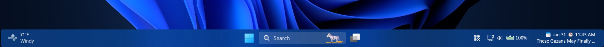

# Fluid theme for Windows 11 Taskbar Styler

**Author**: [The Back Room](https://github.com/the-back-room)



> [!NOTE]
> To use with Light mode, change the `BorderBrush` styleConstant to:
> ```ini
> BorderBrush=<LinearGradientBrush x:Key="ShellTaskbarItemGradientStrokeColorSecondaryBrush" MappingMode="Absolute" StartPoint="0,0" EndPoint="0,3"><LinearGradientBrush.RelativeTransform><ScaleTransform ScaleY="-1" CenterY="0.5" /></LinearGradientBrush.RelativeTransform><LinearGradientBrush.GradientStops><GradientStop Offset="0.33" Color="#0F000000" /><GradientStop Offset="1" Color="#05000000" /></LinearGradientBrush.GradientStops></LinearGradientBrush>
> ```

## Theme selection

The theme is integrated into the mod and can simply be selected from the mod's
settings:

* Open the Windows 11 Taskbar Styler mod in Windhawk.
* Go to the "Settings" tab.
* Select the theme and save the settings.

## Manual installation

The theme styles can also be imported manually. To do that, follow these steps:

* Open the Windows 11 Taskbar Styler mod in Windhawk.
* Go to the "Advanced" tab.
* Copy the content below to the text box under "Mod settings" and click "Save".

<details>
<summary>Content to import (click to expand)</summary>

```json
{
  "theme": "",
  "controlStyles[0].target": "Taskbar.TaskbarFrame > Grid#RootGrid > Taskbar.TaskbarBackground > Grid",
  "controlStyles[0].styles[0]": "Background:=<SolidColorBrush Color=\"{ThemeResource ControlFillColorDefault}\" />",
  "controlStyles[1].target": "Rectangle#BackgroundStroke",
  "controlStyles[1].styles[0]": "Visibility=1",
  "controlStyles[2].target": "SearchUx.SearchUI.SearchButtonRootGrid@CommonStates > Border#BackgroundElement",
  "controlStyles[2].styles[0]": "CornerRadius=$CornerRadius",
  "controlStyles[3].target": "Grid#OverflowRootGrid > Border",
  "controlStyles[3].styles[0]": "CornerRadius=$CornerRadius",
  "controlStyles[4].target": "Rectangle#RunningIndicator",
  "controlStyles[4].styles[0]": "Visibility=1",
  "controlStyles[5].target": "TextBlock#InnerTextBlock[Text=]",
  "controlStyles[5].styles[0]": "Text=",
  "controlStyles[6].target": "Taskbar.TaskbarBackground#HoverFlyoutBackgroundControl > Grid > Rectangle#BackgroundFill",
  "controlStyles[6].styles[0]": "CornerRadius=$CornerRadius",
  "controlStyles[7].target": "Taskbar.ExperienceToggleButton",
  "controlStyles[7].styles[0]": "CornerRadius=$CornerRadius",
  "controlStyles[8].target": "Taskbar.SearchBoxButton",
  "controlStyles[8].styles[0]": "CornerRadius=$CornerRadius",
  "controlStyles[9].target": "Taskbar.TaskListButton",
  "controlStyles[9].styles[0]": "CornerRadius=$CornerRadius",
  "controlStyles[10].target": "Border#BackgroundElement",
  "controlStyles[10].styles[0]": "CornerRadius=$CornerRadius",
  "controlStyles[11].target": "Border#BackgroundDimmingLayer",
  "controlStyles[11].styles[0]": "CornerRadius=$CornerRadius",
  "controlStyles[12].target": "WindowsInternal.ComposableShell.Experiences.Switcher.VirtualDesktopBarElement#VirtualDesktopBar",
  "controlStyles[12].styles[0]": "CornerRadius=$CornerRadius",
  "controlStyles[13].target": "MenuFlyoutPresenter",
  "controlStyles[13].styles[0]": "CornerRadius=$CornerRadius",
  "controlStyles[14].target": "Grid#LayoutRoot",
  "controlStyles[14].styles[0]": "BackgroundTransition:=<BrushTransition Duration=\"0:0:0.083\" />",
  "controlStyles[15].target": "Border#BackgroundBorder",
  "controlStyles[15].styles[0]": "BackgroundTransition:=<BrushTransition Duration=\"0:0:0.083\" />",
  "controlStyles[16].target": "Taskbar.AugmentedEntryPointButton#AugmentedEntryPointButton > Taskbar.TaskListButtonPanel#ExperienceToggleButtonRootPanel > Border#BackgroundElement@CommonStates",
  "controlStyles[16].styles[0]": "Background@ActiveNormal:=$BackgroundNormal",
  "controlStyles[16].styles[1]": "Background@ActivePointerOver:=$BackgroundHover",
  "controlStyles[16].styles[2]": "Background@ActivePressed:=$BackgroundPressed",
  "controlStyles[16].styles[3]": "Background@InactivePointerOver:=$BackgroundHover",
  "controlStyles[16].styles[4]": "Background@InactivePressed:=$BackgroundPressed",
  "controlStyles[16].styles[5]": "BorderBrush@ActiveNormal:=$BorderBrush",
  "controlStyles[16].styles[6]": "BorderBrush@ActivePointerOver:=$BorderBrush",
  "controlStyles[16].styles[7]": "BorderBrush@ActivePressed:=$BorderBrush",
  "controlStyles[16].styles[8]": "BorderBrush@InactivePointerOver:=$BorderBrush",
  "controlStyles[16].styles[9]": "BorderBrush@InactivePressed:=$BorderBrush",
  "controlStyles[16].styles[10]": "BackgroundTransition:=<BrushTransition Duration=\"0:0:0.083\" />",
  "controlStyles[16].styles[11]": "BackgroundSizing=InnerBorderEdge",
  "controlStyles[16].styles[12]": "Margin=1",
  "controlStyles[16].styles[13]": "CornerRadius=$CornerRadius",
  "controlStyles[16].styles[14]": "BorderThickness=$BorderThickness",
  "controlStyles[17].target": "Taskbar.TaskListLabeledButtonPanel@CommonStates > Border#BackgroundElement",
  "controlStyles[17].styles[0]": "Background@ActiveNormal:=$BackgroundNormal",
  "controlStyles[17].styles[1]": "Background@ActivePointerOver:=$BackgroundHover",
  "controlStyles[17].styles[2]": "Background@ActivePressed:=$BackgroundPressed",
  "controlStyles[17].styles[3]": "Background@InactivePointerOver:=$BackgroundHover",
  "controlStyles[17].styles[4]": "Background@InactivePressed:=$BackgroundPressed",
  "controlStyles[17].styles[5]": "Background@MultiWindowNormal:=$BackgroundNormal",
  "controlStyles[17].styles[6]": "Background@MultiWindowActive:=$BackgroundNormal",
  "controlStyles[17].styles[7]": "Background@MultiWindowPointerOver:=$BackgroundHover",
  "controlStyles[17].styles[8]": "Background@MultiWindowPressed:=$BackgroundPressed",
  "controlStyles[17].styles[9]": "BorderBrush@ActiveNormal:=$BorderBrush",
  "controlStyles[17].styles[10]": "BorderBrush@ActivePointerOver:=$BorderBrush",
  "controlStyles[17].styles[11]": "BorderBrush@ActivePressed:=$BorderBrush",
  "controlStyles[17].styles[12]": "BorderBrush@InactivePointerOver:=$BorderBrush",
  "controlStyles[17].styles[13]": "BorderBrush@InactivePressed:=$BorderBrush",
  "controlStyles[17].styles[14]": "BorderBrush@MultiWindowNormal:=$BorderBrush",
  "controlStyles[17].styles[15]": "BorderBrush@MultiWindowActive:=$BorderBrush",
  "controlStyles[17].styles[16]": "BorderBrush@MultiWindowPointerOver:=$BorderBrush",
  "controlStyles[17].styles[17]": "BorderBrush@MultiWindowPressed:=$BorderBrush",
  "controlStyles[17].styles[18]": "BackgroundTransition:=<BrushTransition Duration=\"0:0:0.083\" />",
  "controlStyles[17].styles[19]": "BackgroundSizing=InnerBorderEdge",
  "controlStyles[17].styles[20]": "Margin=1",
  "controlStyles[17].styles[21]": "CornerRadius=$CornerRadius",
  "controlStyles[17].styles[22]": "BorderThickness=$BorderThickness",
  "controlStyles[18].target": "Border#MultiWindowElement",
  "controlStyles[18].styles[0]": "BorderBrush:=$BorderBrush",
  "controlStyles[18].styles[1]": "Background:=$BackgroundNormal",
  "controlStyles[18].styles[2]": "BackgroundTransition:=<BrushTransition Duration=\"0:0:0.083\" />",
  "controlStyles[18].styles[3]": "BackgroundSizing=InnerBorderEdge",
  "controlStyles[18].styles[4]": "Margin=1",
  "controlStyles[18].styles[5]": "CornerRadius=$CornerRadius",
  "controlStyles[18].styles[6]": "BorderThickness=$BorderThickness",
  "controlStyles[19].target": "ContentPresenter#ContentPresenter@CommonStates",
  "controlStyles[19].styles[0]": "Background@ActiveNormal:=$BackgroundNormal",
  "controlStyles[19].styles[1]": "Background@ActivePointerOver:=$BackgroundHover",
  "controlStyles[19].styles[2]": "Background@ActivePressed:=$BackgroundPressed",
  "controlStyles[19].styles[3]": "Background@InactivePointerOver:=$BackgroundHover",
  "controlStyles[19].styles[4]": "Background@InactivePressed:=$BackgroundPressed",
  "controlStyles[19].styles[5]": "BorderBrush@ActiveNormal:=$BorderBrush",
  "controlStyles[19].styles[6]": "BorderBrush@ActivePointerOver:=$BorderBrush",
  "controlStyles[19].styles[7]": "BorderBrush@ActivePressed:=$BorderBrush",
  "controlStyles[19].styles[8]": "BorderBrush@InactivePointerOver:=$BorderBrush",
  "controlStyles[19].styles[9]": "BorderBrush@InactivePressed:=$BorderBrush",
  "controlStyles[19].styles[10]": "BackgroundTransition:=<BrushTransition Duration=\"0:0:0.083\" />",
  "controlStyles[19].styles[11]": "BackgroundSizing=InnerBorderEdge",
  "controlStyles[19].styles[12]": "Margin=1",
  "controlStyles[19].styles[13]": "CornerRadius=$CornerRadius",
  "controlStyles[19].styles[14]": "BorderThickness=$BorderThickness",
  "controlStyles[20].target": "ContentPresenter#ContentPresenter > Grid#ContentGrid > Microsoft.UI.Xaml.Controls.AnimatedVisualPlayer#LottieIcon",
  "controlStyles[20].styles[0]": "Visibility=1",
  "controlStyles[21].target": "SystemTray.CopilotIcon#CopilotIcon > Grid#ContainerGrid > Border#BackgroundBorder",
  "controlStyles[21].styles[0]": "Visibility=1",
  "styleConstants[0]": "BorderBrush=<LinearGradientBrush x:Key=\"ShellTaskbarItemGradientStrokeColorSecondaryBrush\" MappingMode=\"Absolute\" StartPoint=\"0,0\" EndPoint=\"0,3\"><LinearGradientBrush.GradientStops><GradientStop Offset=\"0.33\" Color=\"#1AFFFFFF\" /><GradientStop Offset=\"1\" Color=\"#0FFFFFFF\" /></LinearGradientBrush.GradientStops></LinearGradientBrush>",
  "styleConstants[1]": "BackgroundNormal=<SolidColorBrush Color=\"{ThemeResource ControlFillColorDefault}\" />",
  "styleConstants[2]": "BackgroundHover=<SolidColorBrush Color=\"{ThemeResource ControlFillColorSecondary}\" />",
  "styleConstants[3]": "BackgroundPressed=<SolidColorBrush Color=\"{ThemeResource ControlFillColorTertiary}\" />",
  "styleConstants[4]": "BorderThickness=2",
  "styleConstants[5]": "CornerRadius=4",
  "resourceVariables[0].variableKey": "",
  "resourceVariables[0].value": ""
}
```

</details>

## Taskbar Clock Customization (Optional)

The get the clock to show up like it does in the screenshot, follow these steps:

* Open the Taskbar Clock Customization mod in Windhawk.
* Go to the "Advanced" tab.
* Copy the content below to the text box under "Mod settings" and click "Save".


<details>
<summary>Content to import (click to expand)</summary>

```json
{
"ShowSeconds": 0,
"TimeFormat": "hh':'mm tt",
"DateFormat": "MMM dd",
"WeekdayFormat": "dddd",
"WeekdayFormatCustom": "Sun, Mon, Tue, Wed, Thu, Fri, Sat",
"TopLine": "📅 %date% 🕒 %time%",
"BottomLine": "%web1%",
"MiddleLine": "%weekday%",
"TooltipLine": "%web1_full%%n%%n%%media_status% %media_artist% - %media_title%",
"TooltipLineMode": "append",
"Width": 180,
"Height": 60,
"MaxWidth": 0,
"TextSpacing": 0,
"DataCollection.NetworkMetricsFormat": "mbsDynamic",
"DataCollection.NetworkMetricsFixedDecimals": -1,
"DataCollection.PercentageFormat": "spacePaddingAndSymbol",
"DataCollection.UpdateInterval": 1,
"DataCollection.NetworkAdapterName": "",
"DataCollection.GpuAdapterName": "",
"MediaPlayer.IgnoredPlayers[0]": "",
"MediaPlayer.MaxLength": 28,
"MediaPlayer.NoMediaText": "No media",
"MediaPlayer.RemoveBrackets": 1,
"WebContentWeatherLocation": "",
"WebContentWeatherFormat": "%c 🌡️%t 🌬️%w",
"WebContentWeatherUnits": "autoDetect",
"WebContentsItems[0].Url": "https://rss.nytimes.com/services/xml/rss/nyt/World.xml",
"WebContentsItems[0].BlockStart": "<item>",
"WebContentsItems[0].Start": "<title>",
"WebContentsItems[0].End": "</title>",
"WebContentsItems[0].ContentMode": "xmlHtml",
"WebContentsItems[0].SearchReplace[0].Search": "",
"WebContentsItems[0].SearchReplace[0].Replace": "",
"WebContentsItems[0].MaxLength": 28,
"WebContentsUpdateInterval": 10,
"TimeZones[0]": "",
"TimeStyle.Hidden": 0,
"TimeStyle.TextColor": "",
"TimeStyle.TextAlignment": "Center",
"TimeStyle.FontSize": 0,
"TimeStyle.FontFamily": "",
"TimeStyle.FontWeight": "",
"TimeStyle.FontStyle": "",
"TimeStyle.FontStretch": "",
"TimeStyle.CharacterSpacing": 0,
"DateStyle.Hidden": 0,
"DateStyle.TextColor": "",
"DateStyle.TextAlignment": "Center",
"DateStyle.FontSize": 0,
"DateStyle.FontFamily": "",
"DateStyle.FontWeight": "",
"DateStyle.FontStyle": "",
"DateStyle.FontStretch": "",
"DateStyle.CharacterSpacing": 0,
"oldTaskbarOnWin11": 0
}
```

</details>
